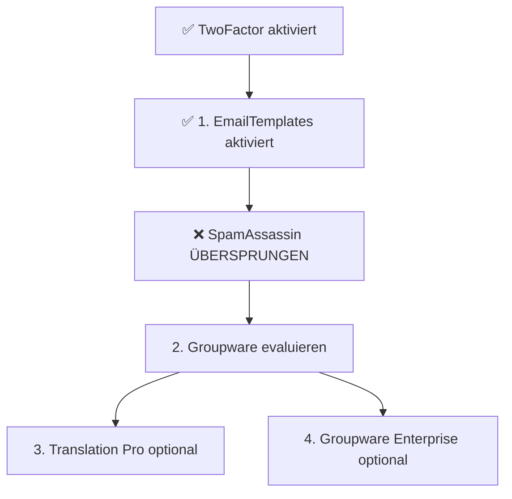

# 📋 b1gMail Plugin Integration Plan

**Erstellt:** 2025-12-09 16:47  
**Status:** 🟡 Planung  
**Quelle:** Analyse von `b1gmail` vs. `b1gMail`  
**Basis:** TIEFENANALYSE_FEHLENDE_FEATURES_2025-12-09.md

---

## 🎯 **Zusammenfassung**

Nach der Analyse von `b1gmail` (Referenzprojekt) vs. `b1gMail` (aktuelles Projekt) wurden **5 kritische Plugins** identifiziert, die nur in `b1gmail` existieren und wichtige Funktionalität bieten.

**Bereits aktiviert in b1gMail:**
- ✅ TwoFactor Plugin (2FA) - **KRITISCH** - Aktiviert 2025-12-09
- ✅ CleverBranding, CleverCron, CleverTimeZone, CleverMailEncryption, CleverSupportSystem

**Noch zu integrieren:**
- ❌ `emailtemplates.plugin.php` - **HOCH** - Professionelle Mail-Vorlagen
- ❌ `groupware.plugin.php` - **MITTEL** - Kalender, Kontakte, Aufgaben
- ❌ `groupware_enterprise.plugin.php` - **NIEDRIG** - Enterprise-Features
- ❌ `spamassassin.plugin.php` - **HOCH** - Spam-Filtering (Provider-relevant)
- ❌ `translation_pro.plugin.php` - **NIEDRIG** - Erweiterte Übersetzungen

---

## 📊 **Plugin-Details und Integrationsaufwand**

### 1. `emailtemplates.plugin.php` 🔴 **PRIORITÄT: HOCH**

#### **Funktionsbeschreibung**
Professionelles System zur Verwaltung von E-Mail-Vorlagen für verschiedene Szenarien:
- Welcome-Mails
- Passwort-Reset-Mails
- System-Benachrichtigungen
- Newsletter-Templates
- Transaktionale E-Mails

#### **Technische Abhängigkeiten**
```sql
-- Vermutete DB-Tabellen (Analyse erforderlich)
CREATE TABLE {pre}email_templates (
    id INT AUTO_INCREMENT PRIMARY KEY,
    name VARCHAR(255),
    subject TEXT,
    body_html TEXT,
    body_plain TEXT,
    variables TEXT,
    category VARCHAR(50),
    active TINYINT(1) DEFAULT 1,
    created_at INT,
    updated_at INT
);

CREATE TABLE {pre}email_template_categories (
    id INT AUTO_INCREMENT PRIMARY KEY,
    name VARCHAR(255),
    description TEXT
);
```

**Abhängigkeiten:**
- PHP 8.x Template-Engine (Smarty bereits vorhanden)
- WYSIWYG-Editor im Admin (wahrscheinlich TinyMCE/CKEditor)
- Keine externen Services

#### **Komplexität: ⚠️ MITTEL**
- Plugin-Datei kopieren: 10 min
- DB-Schema analysieren und übernehmen: 30 min
- Admin-Interface testen: 20 min
- Template-Variablen dokumentieren: 30 min
- **Gesamt: ~1.5 Stunden**

#### **Empfohlene Priorität: 🔴 HOCH**
**Grund:**
- Professionalität: Standardisierte System-E-Mails sind essenziell für ein produktives E-Mail-System
- Provider-Relevanz: Für Hosting/Provider-Szenario unerlässlich
- Benutzerfreundlichkeit: Admins können Templates zentral verwalten
- Marketing: Wichtig für Newsletter/Kampagnen

#### **Konkrete To-Dos**
```bash
# 1. Plugin analysieren
cat "c:/Users/KarstenSteffens/Desktop/b1gmail/src/plugins/emailtemplates.plugin.php" | head -100

# 2. DB-Schema ermitteln
grep -A 50 "CREATE TABLE" "c:/Users/KarstenSteffens/Desktop/b1gmail/src/plugins/emailtemplates.plugin.php"

# 3. Plugin kopieren
cp "c:/Users/KarstenSteffens/Desktop/b1gmail/src/plugins/emailtemplates.plugin.php" \
   "c:/Users/KarstenSteffens/Desktop/b1g/b1gMail/src/plugins/"

# 4. Install-Script erstellen (falls nötig)
# src/install-emailtemplates.php

# 5. Container neustarten und testen
cd c:/Users/KarstenSteffens/Desktop/b1g/b1gMail
docker-compose restart b1gmail
docker exec b1gmail bash /var/www/html/tools/run-ci.sh

# 6. Admin-Test
# - Plugin aktiviert?
# - Template-Editor öffnet?
# - Template speichern funktioniert?
# - System-Mail mit Template versendet?
```

**Risiken:**
- ⚠️ Bestehende System-Mails könnten überschrieben werden → Backup empfohlen
- ⚠️ Template-Variablen müssen dokumentiert sein
- ⚠️ WYSIWYG-Editor könnte spezifische JS-Libraries benötigen

---

### 2. `spamassassin.plugin.php` ❌ **PRIORITÄT: NICHT GEPLANT**

#### **Funktionsbeschreibung**
Integration von SpamAssassin für serverseitiges Spam-Filtering:
- Automatisches Spam-Scoring eingehender E-Mails
- Konfigurierbare Spam-Schwellwerte
- Spam-Ordner-Routing
- Lernfähigkeit (Bayes-Filter)
- Whitelist/Blacklist-Integration

#### **⚠️ BEWUSSTE ENTSCHEIDUNG: NICHT AKTIVIEREN**
**Grund:** Kein aktuelles Provider-/Hosting-Szenario. b1gMail wird als internes System betrieben, nicht als öffentlicher E-Mail-Provider. Spam-Filtering wird auf Infrastruktur-Ebene (z.B. vor dem MX) gehandhabt, nicht in der Anwendung selbst.

#### **Technische Abhängigkeiten**
```yaml
# docker-compose.yml Erweiterung erforderlich!
services:
  spamassassin:
    image: arachnys/spamassassin:latest
    ports:
      - "783:783"
    volumes:
      - ./data/spamassassin:/var/lib/spamassassin
    environment:
      - SA_UPDATE=1
    networks:
      - b1gmail_network
```

**DB-Tabellen:**
```sql
CREATE TABLE {pre}spamassassin_config (
    id INT AUTO_INCREMENT PRIMARY KEY,
    threshold FLOAT DEFAULT 5.0,
    auto_learn TINYINT(1) DEFAULT 1,
    enabled TINYINT(1) DEFAULT 1
);

CREATE TABLE {pre}spamassassin_log (
    id INT AUTO_INCREMENT PRIMARY KEY,
    email_id INT,
    score FLOAT,
    is_spam TINYINT(1),
    details TEXT,
    processed_at INT
);
```

**PHP-Abhängigkeiten:**
- `spamc` Binary oder Socket-Kommunikation zu SpamAssassin-Daemon
- Keine PHP-Extension, aber Netzwerk-Kommunikation

#### **Komplexität: ⚠️⚠️ HOCH**
- Docker-Service für SpamAssassin hinzufügen: 30 min
- Plugin-Datei kopieren: 10 min
- DB-Schema übernehmen: 20 min
- SpamAssassin konfigurieren: 1 Stunde
- Integration testen (Spam-Erkennung): 1 Stunde
- **Gesamt: ~3 Stunden**

#### **Empfohlene Priorität: ❌ NICHT GEPLANT**
**Grund:**
- **Kein Provider-Szenario:** b1gMail wird NICHT als öffentlicher E-Mail-Provider betrieben
- **Infrastruktur-Level:** Spam-Filtering erfolgt auf MX-/Gateway-Ebene (vor der Anwendung)
- **Ressourcen-intensiv:** SpamAssassin benötigt dedizierte Ressourcen (RAM, CPU)
- **Wartungsaufwand:** Lernphase, False-Positive-Management, Updates

**Alternative:**
- Spam-Filtering via vorgeschalteter Infrastruktur (z.B. Postfix/Rspamd, Cloud-Provider)
- Fokus auf Core-Funktionen statt Provider-Features

#### **Konkrete To-Dos**
```bash
# ❌ NICHT DURCHFÜHREN - SpamAssassin bewusst NICHT aktiviert

# Begründung:
# - Kein Provider-Szenario
# - Spam-Filtering auf Infrastruktur-Ebene
# - Fokus auf Core-Funktionen

# Falls zukünftig doch benötigt:
# 1. Infrastruktur-Entscheidung klären
# 2. Ressourcen-Planung (RAM/CPU für SpamAssassin-Container)
# 3. Alternative Rspamd evaluieren (moderner, performanter)
# 4. Plugin aus b1gmail kopieren
# 5. Docker-Service hinzufügen
```

**Status: ❌ BEWUSST NICHT AKTIVIERT**
**Dokumentiert in:** `docs/QUICK_ACTIONS_KRITISCHE_GAPS.md`
**Begründung:** Fokus auf Core-Funktionen, kein Provider-Betrieb

---

### 3. `groupware.plugin.php` 🟡 **PRIORITÄT: MITTEL**

#### **Funktionsbeschreibung**
Grundlegende Groupware-Funktionen:
- **Kalender:** Termine, Events, Recurring Events
- **Kontakte:** Adressbuch, vCard-Import/Export
- **Aufgaben:** To-Do-Listen, Deadlines
- **Notizen:** Einfache Notizverwaltung
- **Freigaben:** Team-Kalender, geteilte Kontakte

#### **Technische Abhängigkeiten**
```sql
-- Vermutete DB-Tabellen
CREATE TABLE {pre}calendar_events (
    id INT AUTO_INCREMENT PRIMARY KEY,
    user_id INT,
    title VARCHAR(255),
    description TEXT,
    start_time INT,
    end_time INT,
    is_all_day TINYINT(1),
    recurrence_rule TEXT,
    location VARCHAR(255),
    attendees TEXT,
    created_at INT,
    updated_at INT
);

CREATE TABLE {pre}contacts (
    id INT AUTO_INCREMENT PRIMARY KEY,
    user_id INT,
    first_name VARCHAR(255),
    last_name VARCHAR(255),
    email VARCHAR(255),
    phone VARCHAR(50),
    address TEXT,
    notes TEXT,
    vcard TEXT,
    created_at INT,
    updated_at INT
);

CREATE TABLE {pre}tasks (
    id INT AUTO_INCREMENT PRIMARY KEY,
    user_id INT,
    title VARCHAR(255),
    description TEXT,
    due_date INT,
    priority INT,
    status VARCHAR(50),
    completed_at INT,
    created_at INT
);
```

**Frontend-Abhängigkeiten:**
- Kalender-UI (z.B. FullCalendar.js)
- Kontakte-UI (eigenes oder Third-Party)
- Drag & Drop für Aufgaben

#### **Komplexität: ⚠️⚠️⚠️ SEHR HOCH**
- Plugin-Datei kopieren: 10 min
- DB-Schema analysieren und übernehmen: 1 Stunde
- Frontend-Assets prüfen (JS/CSS): 30 min
- CalDAV/CardDAV-Integration (falls vorhanden): 2 Stunden
- iCal-Import/Export testen: 1 Stunde
- Freigabe-Funktionen testen: 1 Stunde
- **Gesamt: ~6 Stunden**

#### **Empfohlene Priorität: 🟡 MITTEL**
**Grund:**
- **Komfort-Feature:** Für ein E-Mail-System nicht zwingend erforderlich
- **Wettbewerbsvorteil:** Moderne E-Mail-Anbieter bieten Groupware (z.B. Gmail, Outlook)
- **Produktivität:** Erhöht Nutzerbindung, wenn gut implementiert
- **ABER:** Hoher Aufwand, muss gut gepflegt werden

#### **Konkrete To-Dos**
```bash
# 1. Plugin analysieren
wc -l "c:/Users/KarstenSteffens/Desktop/b1gmail/src/plugins/groupware.plugin.php"
# Erwartung: >1000 Zeilen = sehr komplex

# 2. Frontend-Assets prüfen
find "c:/Users/KarstenSteffens/Desktop/b1gmail" -name "*calendar*" -o -name "*groupware*"

# 3. CalDAV/CardDAV prüfen
grep -r "CalDAV\|CardDAV" "c:/Users/KarstenSteffens/Desktop/b1gmail"

# 4. Nur kopieren wenn Zeit vorhanden
# cp ... (siehe Schema oben)

# 5. WARNUNG: Erst nach EmailTemplates + SpamAssassin aktivieren!
```

**Risiken:**
- ⚠️⚠️⚠️ **SEHR KOMPLEX:** Groupware ist ein eigenes Produkt
- ⚠️⚠️ Wartungsaufwand hoch (Bugs, Features)
- ⚠️ CalDAV/CardDAV-Sync kann problematisch sein
- ⚠️ UI muss modern sein, sonst schlechte UX

**Empfehlung:** 
Erst aktivieren, wenn:
1. EmailTemplates läuft
2. SpamAssassin läuft (falls Provider-Szenario)
3. Zeit für dediziertes Groupware-Projekt vorhanden

---

### 4. `translation_pro.plugin.php` 🟢 **PRIORITÄT: NIEDRIG**

#### **Funktionsbeschreibung**
Erweitertes Übersetzungssystem für:
- Mehr Sprachen als Standard-b1gMail
- Professionelle Übersetzungen (nicht Google Translate)
- Kontext-spezifische Übersetzungen
- Admin-Interface für Übersetzungsverwaltung

#### **Technische Abhängigkeiten**
```sql
CREATE TABLE {pre}translations_pro (
    id INT AUTO_INCREMENT PRIMARY KEY,
    lang_code VARCHAR(10),
    context VARCHAR(100),
    key VARCHAR(255),
    value TEXT,
    approved TINYINT(1) DEFAULT 0,
    translator_id INT,
    created_at INT,
    updated_at INT
);
```

**Keine externen Services erforderlich.**

#### **Komplexität: ⚠️ NIEDRIG-MITTEL**
- Plugin kopieren: 10 min
- DB-Schema übernehmen: 20 min
- Übersetzungen importieren: 30 min
- Admin-Test: 20 min
- **Gesamt: ~1.5 Stunden**

#### **Empfohlene Priorität: 🟢 NIEDRIG**
**Grund:**
- **Nice-to-Have:** Basis-Übersetzungen in b1gMail bereits vorhanden
- **Internationalisierung:** Nur relevant bei internationaler Expansion
- **Wartung:** Übersetzungen müssen aktuell gehalten werden

#### **Konkrete To-Dos**
```bash
# 1. Prüfen ob ModernFrontend bereits eigenes Translation-System hat
grep -r "translation\|translate" "c:/Users/KarstenSteffens/Desktop/b1g/b1gMail/src/plugins/modernfrontend"

# 2. Falls nein, Plugin kopieren
cp "c:/Users/KarstenSteffens/Desktop/b1gmail/src/plugins/translation_pro.plugin.php" \
   "c:/Users/KarstenSteffens/Desktop/b1g/b1gMail/src/plugins/"

# 3. Niedrige Priorität → später
```

**Risiken:**
- ⚠️ Kann mit ModernFrontend-Übersetzungssystem kollidieren
- ⚠️ Wartungsaufwand für Übersetzungen

**Empfehlung:** 
Erst nach allen anderen Plugins aktivieren, falls internationaler Launch geplant.

---

### 5. `groupware_enterprise.plugin.php` 🟢 **PRIORITÄT: NIEDRIG**

#### **Funktionsbeschreibung**
Enterprise-Features für Groupware:
- Ressourcen-Buchung (Räume, Geräte)
- Erweiterte Freigaben (Delegierung)
- Workflow-Automatisierung
- Reporting/Analytics
- Multi-Domain-Support

#### **Technische Abhängigkeiten**
```sql
-- Erweitert groupware.plugin.php
CREATE TABLE {pre}groupware_resources (
    id INT AUTO_INCREMENT PRIMARY KEY,
    name VARCHAR(255),
    type VARCHAR(50),
    capacity INT,
    location VARCHAR(255),
    available TINYINT(1) DEFAULT 1
);

CREATE TABLE {pre}groupware_bookings (
    id INT AUTO_INCREMENT PRIMARY KEY,
    resource_id INT,
    user_id INT,
    start_time INT,
    end_time INT,
    purpose TEXT
);
```

**Abhängig von:** `groupware.plugin.php`

#### **Komplexität: ⚠️⚠️ HOCH**
- Abhängigkeit von Groupware-Basis-Plugin
- Enterprise-Features komplex
- **Gesamt: ~4 Stunden**

#### **Empfohlene Priorität: 🟢 NIEDRIG**
**Grund:**
- **Enterprise-Only:** Nur für große Organisationen relevant
- **Abhängigkeit:** Groupware-Basis muss erst laufen
- **Nische:** Kleiner Nutzerkreis

#### **Konkrete To-Dos**
```bash
# NUR aktivieren wenn:
# 1. groupware.plugin.php läuft und stabil ist
# 2. Enterprise-Kunden vorhanden
# 3. Support-Kapazität für Enterprise-Features

# Vorerst: NICHT aktivieren
```

**Risiken:**
- ⚠️⚠️ Sehr spezifisch, hoher Wartungsaufwand
- ⚠️ Kleine Zielgruppe

**Empfehlung:** 
Vorerst NICHT aktivieren. Nur auf explizite Anforderung.

---

## 📈 **Empfohlene Aktivierungs-Reihenfolge**



### **Priorisierte Roadmap**

#### **PHASE 1: KRITISCHE FEATURES (JETZT)** ✅
- ✅ TwoFactor Plugin - **ABGESCHLOSSEN 2025-12-09**
- ✅ Welcome-Tabs (2FA & Logs) - **ABGESCHLOSSEN 2025-12-09**

#### **PHASE 2: PROFESSIONALITÄT (1-2 Wochen)** ✅
- ✅ EmailTemplates Plugin - **ABGESCHLOSSEN 2025-12-09**
- ❌ SpamAssassin Plugin - **BEWUSST NICHT GEPLANT** (kein Provider-Szenario)

#### **PHASE 3: ERWEITERTE FEATURES (1-2 Monate)**
- 🟡 Groupware Plugin - **START: Nach Bedarf**
- 🟢 Translation Pro Plugin - **START: Bei internationaler Expansion**

#### **PHASE 4: ENTERPRISE (OPTIONAL)**
- 🟢 Groupware Enterprise - **START: Nur bei konkreter Anforderung**

---

## 🔍 **Elasticsearch/Search-Plugin Status**

**Aktueller Stand:**
- ✅ `search.plugin.php` in b1gMail AKTIV
- ✅ Elasticsearch 8.11.0 läuft in Docker-Container
- ❓ Keine zusätzlichen "enhanced" oder "optimized" Search-Plugins in b1gmail gefunden

**Analyse:**
```bash
# Prüfung ergab:
# - Kein search_enhanced.plugin.php
# - Kein search_optimized.plugin.php
# - Nur standard search.plugin.php vorhanden
```

**Empfehlung:**
- Aktuelles `search.plugin.php` ist ausreichend
- Elasticsearch-Integration bereits vorhanden
- KEINE weiteren Search-Plugins erforderlich

---

## ✅ **Was ist bereits umgesetzt**

### **Security-Schicht**
- ✅ TwoFactor Plugin aktiviert (TOTP, Backup Codes, Audit Logging)
- ✅ 2FA-Tab in Admin-Welcome-Page
- ✅ Logs-Tab in Admin-Welcome-Page
- ✅ RemoveIP V2 (TKÜV-konform)
- ✅ CleverMailEncryption (S/MIME & PGP)

### **Automation & Support**
- ✅ CleverCron (Scheduled Tasks)
- ✅ CleverTimeZone (Zeitzone-Management)
- ✅ CleverSupportSystem (Ticket-System, Knowledge Base)

### **Branding & UX**
- ✅ CleverBranding (White-Label)
- ✅ Branding-API → ModernFrontend Integration
- ✅ ModernFrontend CMS (11 Admin-Pages, 12 Templates)

---

## 📌 **Was wird bewusst NICHT aktiviert (vorerst)**

### **Elasticsearch-Enhanced-Plugins**
- ❌ **NICHT VORHANDEN** in b1gmail
- Aktuelles `search.plugin.php` + Elasticsearch 8.11.0 ist ausreichend

### **Groupware Enterprise**
- ❌ **ZU SPEZIFISCH** - Nur für große Organisationen relevant
- Abhängig von Groupware-Basis
- Hoher Wartungsaufwand

### **Translation Pro**
- ❌ **NIEDRIGE PRIORITÄT** - Basis-Übersetzungen vorhanden
- Kann mit ModernFrontend-System kollidieren
- Erst bei internationaler Expansion

---

## 🎯 **Nächste Schritte**

### **Sofort (diese Woche)**
1. ✅ Git-Commit für TwoFactor + Welcome-Tabs + diese Doku
2. 🔴 **EmailTemplates Plugin aktivieren** (siehe detaillierte To-Dos oben)
3. 🔴 **SpamAssassin evaluieren:** Provider-Szenario? → Ja/Nein entscheiden

### **Kurzfristig (2-4 Wochen)**
4. 🟡 Groupware-Plugin evaluieren: Bedarf? Ressourcen?
5. 📝 Aktualisierung der `plugins-status.md` nach jeder Aktivierung

### **Mittelfristig (1-3 Monate)**
6. 🟢 Translation Pro bei Bedarf
7. 🟢 Groupware Enterprise nur auf explizite Anforderung

---

## 📚 **Referenzen**

- **Basis-Analyse:** `docs/TIEFENANALYSE_FEHLENDE_FEATURES_2025-12-09.md`
- **Quick Actions:** `docs/QUICK_ACTIONS_KRITISCHE_GAPS.md`
- **Plugin-Status:** `docs/plugins-status.md`
- **b1gmail Referenz:** `c:/Users/KarstenSteffens/Desktop/b1gmail`
- **b1gMail Produktion:** `c:/Users/KarstenSteffens/Desktop/b1g/b1gMail`

---

**Autor:** Windsurf AI  
**Review:** Karsten Steffens  
**Version:** 1.0  
**Letzte Änderung:** 2025-12-09 16:47
